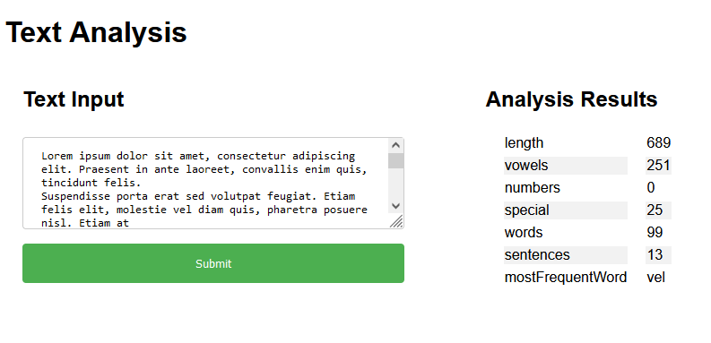
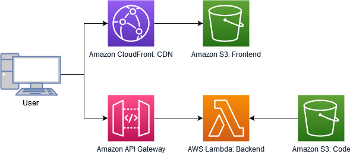
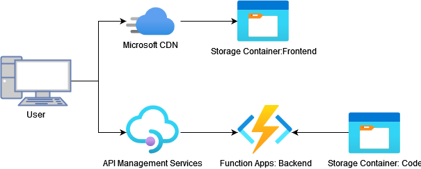
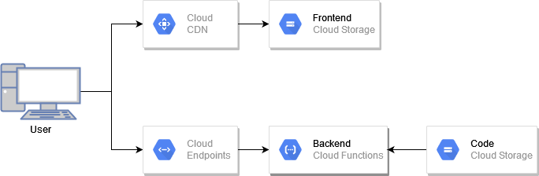

Serverless Web App on AWS, GCP, and Azure using Terraform
===

This sample application contains full [Terraform](https://terraform.io/) deployments for the [three major cloud platforms](https://www.statista.com/chart/18819/worldwide-market-share-of-leading-cloud-infrastructure-service-providers/), namely: [Amazon Web Services (AWS)](https://aws.amazon.com/), [Microsoft Azure (AZ)](https://azure.microsoft.com/), and [Google Cloud Platform (GCP)](https://cloud.google.com/).

## About this Project

The goal of this project is to make those three deployments as homogeneous as possible to be able to compare the differences. Since not all cloud platforms offer the same features and work similarly, the resulting architectures differ slightly. Another aim was to make the deployments self-contained (they deploy the function code and frontend automatically), use only [Serverless](https://www.cloudflare.com/learning/serverless/what-is-serverless/) services as well as move all common parts out of the deployment (shared OpenAPI config and code).

The goals of the Terraform deployments in this project are:

- Self-contained
- Use only Serverless services
- Use standards like OpenAPI
- Make the architectures as homogeneous as possible
- Apply best-practices
- Move common parts out of the deployment

The application itself is a simple text analysis service that comes with a web-based frontend:

## Contents

The relevant parts of this repo are:

| Folder | Description |
| ---- | ----------- |
| .devcontainer | The vscode devcontainer for this project |
| .github | Reamde images etc |
| .vscode | Visual Studio Code settings |
| was | The AWS deployment |
| azure | The Azure deployment |
| common | Common parts of the deployments |
| common/API | The OpenAPI config |
| common/function | The code for the FaaS function |
| common/website | The static website for the frontend |
| common/mime-types.json | The MIME type definitions for uploads |
| GCP | The GCP deployment |
| justfile | The just configuration |

## Setup

You can start up this project rather quickly using the [vscode devcontainers](https://code.visualstudio.com/docs/remote/containers), which are based on Docker.

Using the command runner [just](https://github.com/casey/just/), apply the Terraform configuration using `just apply <folder>`, with `aws`, `GCP` or `azure` as the folder name.

## The Architecture

### General

The application requires a frontend (a static website) and backend (based on [Function as a Service (FaaS)](https://en.wikipedia.org/wiki/Function_as_a_service) offerings). The frontend needs to be served using a [Content Delivery Network (CDN)](https://www.cloudflare.com/learning/cdn/what-is-a-cdn/) to improve stability and page speeds. The FaaS function of the backend should sit behind an [API Gateway](https://www.redhat.com/en/topics/api/what-does-an-api-gateway-do).

### Amazon Web Services

### Azure

#### Caveats

- Functions can be called directly, bypassing the API Gateway
- Terraform currently only supports one origin per API Gateway
- Functions don't support ES6 style JavaScript modules (https://github.com/Azure/azure-functions-nodejs-worker/issues/104). However, this feature is in preview https://docs.microsoft.com/en-us/azure/azure-functions/functions-reference-node#ecmascript-modules

### Google Cloud Platform

#### Caveats

- Google requires a load balancer in front of the CDN, which can get expensive
- There is no Google-provided domain/certificate for the CDN, so an IPv4 has to be provisioned
- The Google API Gateway only supports OpenAPI v2, not v3. Therefore the [api-spec-converter](https://github.com/LucyBot-Inc/api-spec-converter) has te be used to convert the OpenAPI definition (using `API-spec-converter --from=openapi_3 --to=swagger_2 --syntax=yaml openapi.yaml`).
